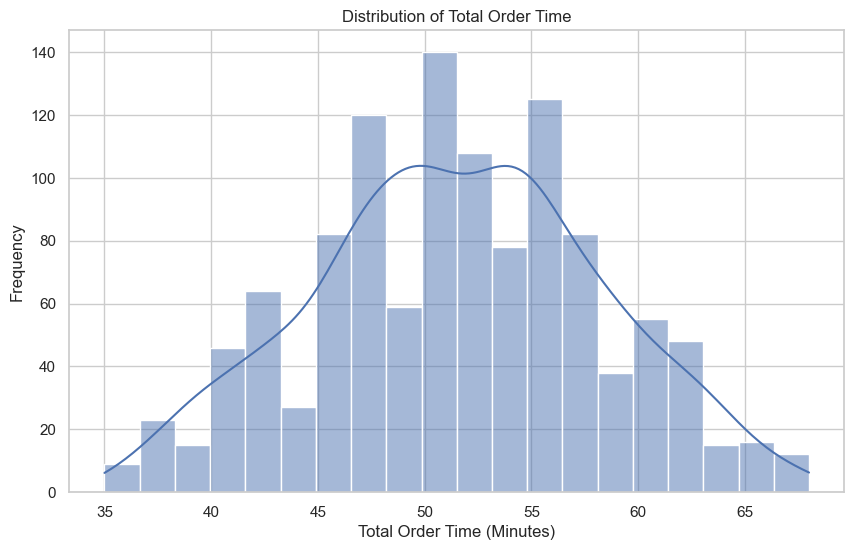
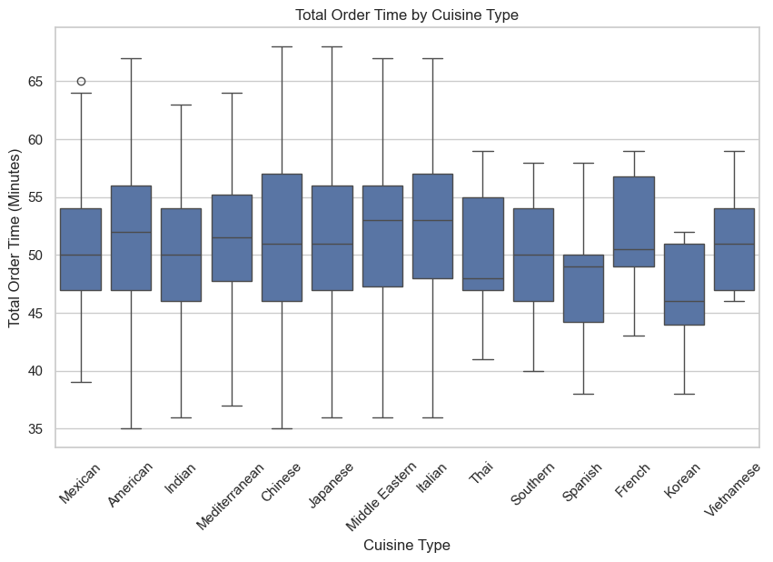
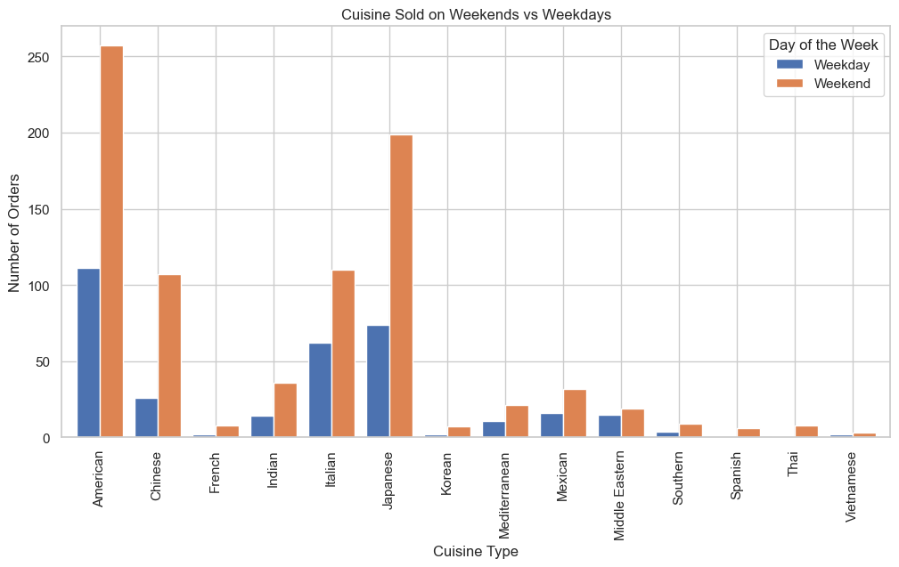
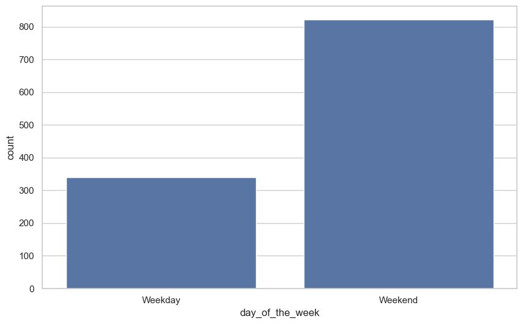

# NYC Restaurants recommendation system
A data-driven project that analyzes NYC food order data to recommend top restaurants based on order count, customer ratings, and delivery efficiency. Includes insights on cuisine trends and restaurant performance.

## Overview

This project focuses on analyzing customer order data from various restaurants to uncover insights about performance, customer satisfaction, and operational efficiency. Additionally, we explore predictive modeling tasks such as forecasting delivery time, customer ratings, and order costs.

By leveraging this dataset, restaurant owners, food delivery platforms, and analysts can better understand key drivers of customer satisfaction and make data-driven decisions to optimize operations.

---

## Dataset Description

The dataset contains **1,898 records** of food orders with rich details about restaurants, customers, order times, and ratings.

### Features

| Feature Name             | Type         | Description |
|--------------------------|--------------|-------------|
| `order_id`               | Categorical  | Unique identifier for each order |
| `customer_id`            | Categorical  | Unique identifier for each customer |
| `restaurant_name`        | Categorical  | Name of the restaurant |
| `cuisine_type`           | Categorical  | Type of cuisine (e.g., Japanese, Mexican) |
| `cost_of_the_order`      | Numerical    | Total cost of the order (USD) |
| `day_of_the_week`        | Categorical  | Weekday or Weekend |
| `rating`                 | Numerical / Text | Rating given by customer (1–5), or "Not given" |
| `food_preparation_time`  | Numerical    | Minutes to prepare the food |
| `delivery_time`          | Numerical    | Minutes to deliver the food |

### Data Quality

- The dataset is **well-cleaned** with no missing values in core features.
- Some ratings are marked as **"Not given"** and require preprocessing.
- All time and cost fields are numeric and properly formatted.

---

## Problem Statement

The objective is to explore relationships among various features and build predictive models that address the following tasks:

1. **Predict the total cost of an order** using cuisine type, day of the week, food preparation time, and delivery time.
2. **Predict delivery time** based on preparation time, cuisine type, and customer rating.
3. **Predict customer ratings** using cost, food prep time, delivery time, and restaurant/cuisine type.

These models can help:
- Improve restaurant efficiency
- Anticipate delivery delays
- Estimate costs in real time
- Understand customer satisfaction drivers

---

## Exploratory Data Analysis (EDA)

### Key Observations

#### Order Volume & Popularity
- **Shake Shack**, **The Meatball Shop**, and **Blue Ribbon Sushi** have the highest order counts.
- American and Japanese cuisines dominate in order volume and popularity.

#### Revenue Insights
- **Shake Shack** leads in total sales, driven by high volume.
- **Blue Ribbon Sushi** has the highest average order value, suggesting a premium pricing model.
- Some restaurants have low order volume but high average transaction value.

#### Ratings Breakdown
- Most restaurants have ratings near 4.0.
- Restaurants like **Amma** and **Anjappar Chettinad** scored a perfect 5.0.
- Lower-rated restaurants tend to have long delivery or prep times.

#### Delivery and Prep Times
- Total order time varies widely across restaurants.
- Shorter delivery and prep times generally correlate with higher ratings.

---

## Machine Learning Approach

### Data Preprocessing
- **Categorical encoding** (e.g., cuisine type, day of week)
- **Handling missing values** (ratings marked as "Not given")
- **Scaling** of continuous features (cost, time)

### Modeling Targets
- **Regression**: Predicting cost or delivery time
- **Classification**: Predicting customer ratings (1–5)

### Evaluation Metrics
- MAE / RMSE for regression tasks
- Accuracy, Precision, Recall, F1-Score for classification

---

## Restaurant-Based Recommendations

Based on ratings, delivery time, and order volume:

### Top Recommended Restaurants
| Restaurant              | Rating | Total Order Time (min) |
|-------------------------|--------|-------------------------|
| Westville Hudson        | 5.0    | 35                      |
| Bhatti Indian Grill     | 5.0    | 36                      |
| ilili Restaurant        | 5.0    | 36                      |
| Blue Ribbon Sushi       | 5.0    | 36                      |
| Rubirosa                | 5.0    | 36                      |

### Least-Rated Restaurants
| Restaurant              | Rating | Total Order Time (min) |
|-------------------------|--------|-------------------------|
| RedFarm Broadway        | 3.0    | 63                      |
| The Meatball Shop       | 3.0    | 59                      |
| brgr                    | 3.0    | 55                      |
| Shake Shack             | 3.0    | 52                      |
| Sushi of Gari 46        | 3.0    | 48                      |

---
Visualizations

Here are some key visualizations from the project:
### 1. Distribution of total order over time

*Description*: The plot shows the distribution of total order time.

### 2. Total order time by cuisine type

*Description*: The plot shows the total order time by cuisine type.

### 3. Cuisine Sold on Weekends vs Weekdays

*Description*: The plot shows the total order time by cuisine type.

### 4. Orders based on day of the week

*Description*: The plot shows the orders based on day of the week.

### 5. Average rating by cuisine type

*Description*: The plot shows the Average rating by cuisine type.

### 6. Cuisine type distribution

*Description*: The plot shows the Cuisine type distribution.

--- 
## Key Takeaways

- **American and Japanese cuisines** are the most popular but vary in rating and efficiency.
- **High order count doesn’t always mean high customer satisfaction**—ratings and delivery speed matter.
- **Premium restaurants** can thrive with fewer orders but higher order values.
- **Fast, efficient service** often translates to higher customer ratings.

---

## Future Work

- Implement **personalized customer recommendations** (collaborative filtering).
- Integrate **real-time order prediction** APIs for delivery platforms.
- Deploy models using **Flask/Streamlit** dashboards.
- Expand to include **time-of-day analysis**, **tip amounts**, or **repeat customers**.

---
